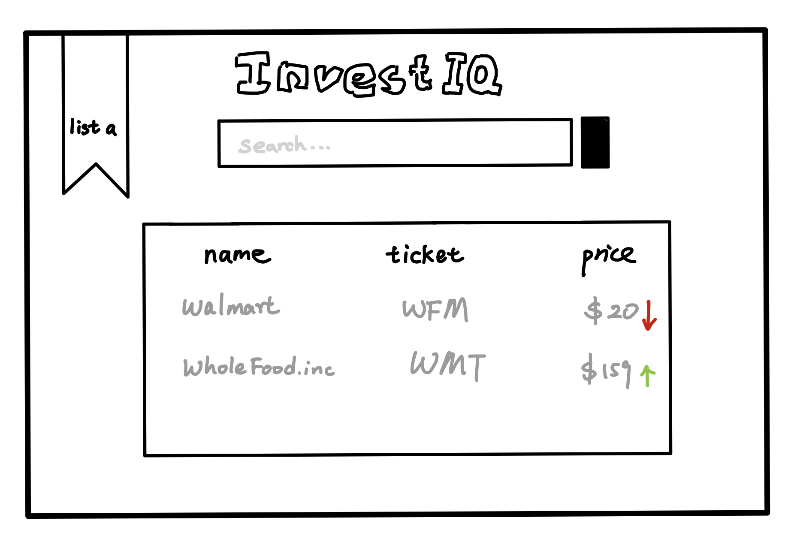
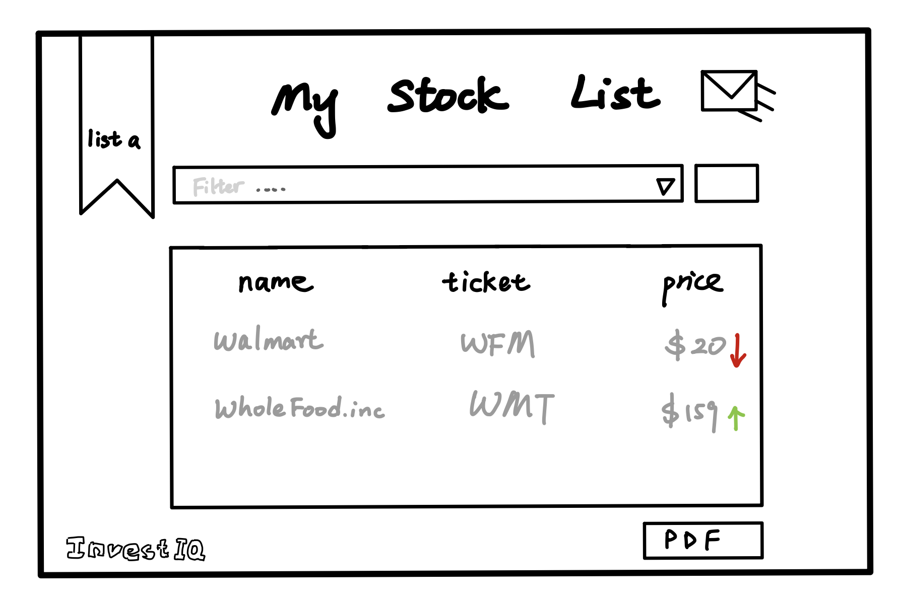
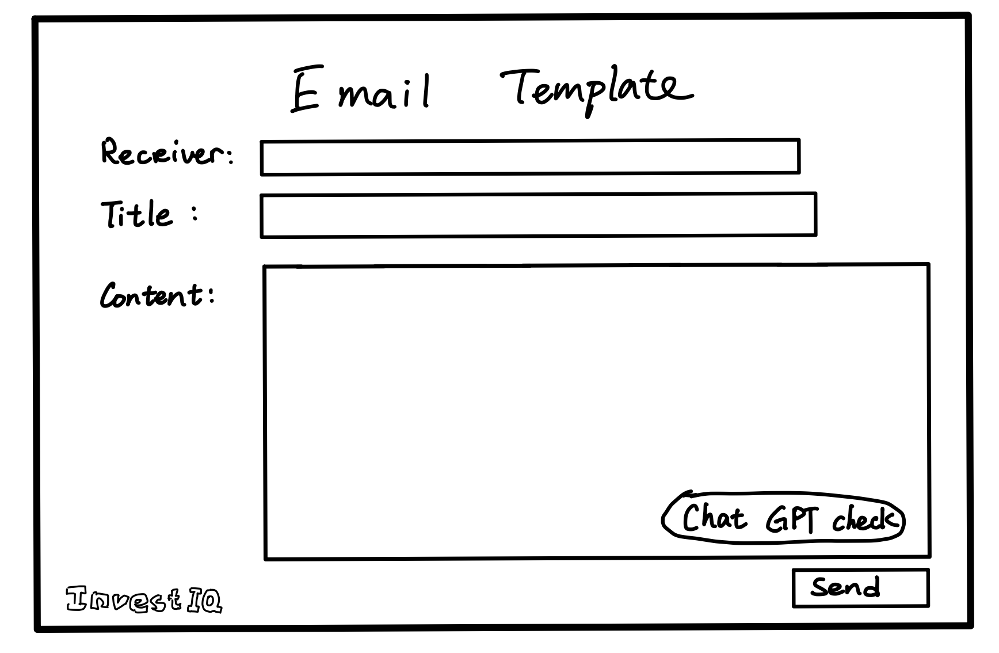
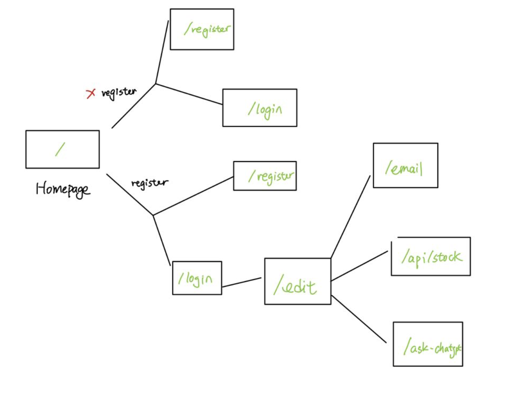

The content below is an example project proposal / requirements document. Replace the text below the lines marked "__TODO__" with details specific to your project. Remove the "TODO" lines.


# InvestIQ

## Overview

(__TODO__: a brief one or two paragraph, high-level description of your project)

Getting simple information about the stock you bought is reallllly difficult. Currently, the Apps about stock trade often illustrates other informations for stock traders. However, as a beginner to just in the finance, it is really hard to understand them and trade those information to trade their stock. 

InvestIQ is a web app that will allow users to keep track of their chosen stock lists and relevant informations about the stock. Users can register and login. Once they're logged in, they can create or view their own stock list. For every list that they have, they can add items to the list or cross off items. Meanwhile, they could also download the PDF version of the page and send it to other people by the option of emails. They could also generate a email template by using the content provided by the ChatGPT API.


## Data Model

The application will store Users, StockListids and Emailinformation

* users can have multiple StockListids (via references)
* each list can have multiple Emailinformation (by embedding)


An Example User:

```javascript
{
  username: "Happier",
  hash: // a password hash,
  StockListids: // an array of references to List documents
}
```

An Example List with Embedded Items:

```javascript
{
  user: // a reference to a User object
  name: "Food Market",
  items: [
    { name: "WholeFood", ticket: "WFM", price: $20},
    { name: "Walmart", ticket: "WMT", price: $139},
  ],
  createdAt: // timestamp
}
```


## [Link to Commented First Draft Schema](db.mjs) 


## Wireframes

/list/create - page for ading a new stock list



/list - page for showing all my stock lists



/email - page for sending email to share stock lists to others 



## Site map



(__TODO__: draw out a site map that shows how pages are related to each other)

Here's a [complex example from wikipedia](https://upload.wikimedia.org/wikipedia/commons/2/20/Sitemap_google.jpg), but you can create one without the screenshots, drop shadows, etc. ... just names of pages and where they flow to.

## User Stories or Use Cases

(__TODO__: write out how your application will be used through [user stories](http://en.wikipedia.org/wiki/User_story#Format) and / or [use cases](https://en.wikipedia.org/wiki/Use_case))

1. I am not a uesr. I could only register a new account to reach further steps
2. If I am a user, then
   1. I can log in to the site
   2. I can create a new stock list 
   3. I can see my stock lists
   4. I can add to my existed stock lists
   5. I could delete the stock lists
   6. I could generate a PDF version of the list
   7. I could send a email and create a template with ChatGPT to share my lists to others

## Research Topics

(__TODO__: the research topics that you're planning on working on along with their point values... and the total points of research topics listed)

* (2 points) Stock API and Chat GPT API
    * To get the accurate stock price, I need to connect one API.
    * To generate an email template, I choose to use Chat GPT API to generate the template based on user input data
* (6 points) React
    * used React as the frontend framework; it is hard, so I give this 5 points

10 points total out of 8 required points 


(___TODO__: addtional points will __not__ count for extra credit)


## [Link to Initial Main Project File](app.mjs) 

(__TODO__: create a skeleton Express application with a package.json, app.mjs, views folder, etc. ... and link to your initial app.mjs)

## Annotations / References Used

(__TODO__: list any tutorials/references/etc. that you've based your code off of)


1. [tutorial on React](https://www.google.com/search?q=tutorial+on+react&rlz=1C5CHFA_enUS969US969&oq=tutorial+on+react&aqs=chrome..69i57j0i512l2j0i22i30l7.3428j0j4&sourceid=chrome&ie=UTF-8#fpstate=ive&vld=cid:6940e391,vid:Ke90Tje7VS0) - (add link to source code that was based on this)

2. [Tutorial about how to embedded Video in the Background](https://redstapler.co/responsive-css-video-background/)

--------------------------------------------------------
Great insights from the assignment template
[passport.js authentication docs](http://passportjs.org/docs) - (add link to source code that was based on this)