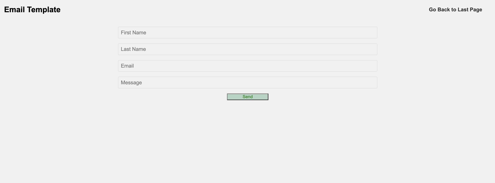

# StackInnerFlow

## Overview

Getting simple information about the stock you bought is reallllly difficult. Currently, the Apps about stock trade often illustrates other informations for stock traders. However, as a beginner to just in the finance, it is really hard to understand them and trade those information to trade their stock. 

InvestIQ is a web app that will allow users to keep track of their chosen stock lists and relevant informations about the stock. Users can register and login. Once they're logged in, they can create or view their own stock list. For every list that they have, they can add items to the list or cross off items. Meanwhile, they could also download the PDF version of the page and send it to other people by the option of emails. They could also generate a email template by using the content provided by the ChatGPT API.


## Data Model

The application will store Users, StockListids information
* users can have multiple Stocks (the ticket of the Stock is the unique id)
* each user will only have one list to store their Stocks 


An Example Item (a stock):

```javascript    
{
  name: "WholeFood", 
  ticket: "WFM", 
  price: 20, 
  date: 04/23/2023
}
```

An Example User (List with Embedded Items):

```javascript
{
  user: // a reference to a User object
  name: "Food Market",
  items: [
    { name: "WholeFood", ticket: "WFM", price: 20, date: 04/23/2023},
    { name: "Walmart", ticket: "WMT", price: 139, date: 04/23/2023},
  ]
}
```


### [Link to Commented First Draft Schema](db.mjs) 


## Wireframes

/ - MainPage


/edit - page for showing all my stock lists  


/email - page for sending email to share stock lists to others  


/ask-chatgpt - page for asking ChatGPT 


## Site map


Here's a [complex example from wikipedia](https://upload.wikimedia.org/wikipedia/commons/2/20/Sitemap_google.jpg), but you can create one without the screenshots, drop shadows, etc. ... just names of pages and where they flow to.

## Actual Page URL
- /             ->   Main/Welcome Page 
- /register     ->   Register Page 
- /login        ->   Login Page 
- /edit         ->   Edit Page where users could have "Send Emails", "Add with API", "Ask ChatGPT", and "Go Back to HomePage" functions
- /email        ->  where user could send emails
- /api/stock    ->  where user could ask API about the price of their selected tickets
- /ask-chatgpt  ->  where user could ask ChatGPT about their investment plans 
- /new        ->  where user could send emails


## User Stories or Use Cases

(__TODO__: write out how your application will be used through [user stories](http://en.wikipedia.org/wiki/User_story#Format) and / or [use cases](https://en.wikipedia.org/wiki/Use_case))

1. I am not a uesr. I could only register a new account to reach further steps
2. If I am a user, then
   1. I can log in to the site
   2. I can create a new stock list 
   3. I can see my stock lists
   4. I can add to my existed stock lists
   5. I could delete the stock lists
   6. I could send a email and create a template with ChatGPT to share my lists to others

## Research Topics


* (2 points) Chat GPT API 
    * To get the accurate stock price, I need to connect one API.
    * To generate an email template, I choose to use Chat GPT API to generate the template based on user input data
* (2 points) EmailJS API 
    * Enable to send the email to user based on their input values 
* (6 points) React
    * used React as the frontend framework; it is hard, so I give this 5 points
* Digital Ocean (1 point) 
    * Cloud to deploy the website 
* Mongodb Altas Cloud Database (1 point) 
    * Cloud database to store the dataset about this webpage
* (5 points) Selenium Test
    * used Selenium to check whether the webpage works 

10 points total out of 10 required points 


(___TODO__: addtional points will __not__ count for extra credit)


## [Link to App.mjs](app.mjs) 
This is the main doc to tell program how to deal with the users API requests 

## [Link to db.mjs](db.mjs)  
This is the link that specifies how to set up the MongoDB database for this project

## [Link to auth.mjs](auth.mjs) 
The docs tell the logic of how to set up the authentication for this project

## [Link to openai.mjs](openai.mjs) 
The docs tell the logic of how to use OpenAI API

## [Link to test.mjs](test.mjs) 
Using selenium to test the code 


https://user-images.githubusercontent.com/95515518/235227702-637c5deb-bacc-4fa3-9161-04e267cc529d.mp4


## Annotations / References Used

1. [tutorial on React](https://www.google.com/search?q=tutorial+on+react&rlz=1C5CHFA_enUS969US969&oq=tutorial+on+react&aqs=chrome..69i57j0i512l2j0i22i30l7.3428j0j4&sourceid=chrome&ie=UTF-8#fpstate=ive&vld=cid:6940e391,vid:Ke90Tje7VS0) 

2. [Tutorial about how to embedded Video in the Background](https://redstapler.co/responsive-css-video-background/)

3. [Advanced ChatGPT Guide - How to build your own Chat GPT Site](https://www.youtube.com/watch?v=bB7xkRsEq-g)

4. [Send Email using HTML + JavaScript (EmailJs Tutorial)](https://www.youtube.com/watch?v=dgcYOm8n8ME)

5. [How to use Selenium](https://www.browserstack.com/guide/automation-using-selenium-javascript)

6. [Building a Real-time stock ticker | Yahoo Finance Web Sockets + React)](https://www.youtube.com/watch?v=flxxyHeBowI&list=RDCMUCLNgu_OupwoeESgtab33CCw&start_radio=1&t=2177s)

--------------------------------------------------------

